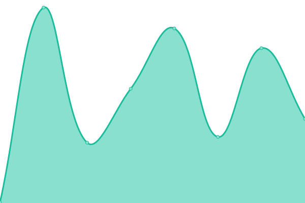
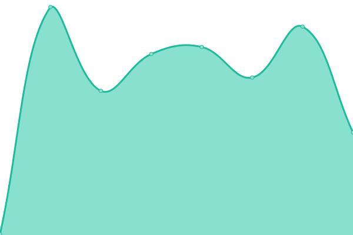

# [📈 Live Status](https://uptime.roan.dev): <!--live status--> **🟩 All systems operational**

This repository contains the open-source uptime monitor and status page for [Upptime](https://upptime.js.org), powered by [Upptime](https://github.com/upptime/upptime).

With [Upptime](https://upptime.js.org), you can get your own unlimited and free uptime monitor and status page, powered entirely by a GitHub repository. We use [Issues](https://github.com/upptime/upptime/issues) as incident reports, [Actions](https://github.com/IIRoan/uptime/actions) as uptime monitors, and [Pages](https://uptime.roan.dev) for the status page.

<!--start: status pages-->
<!-- This summary is generated by Upptime (https://github.com/upptime/upptime) -->
<!-- Do not edit this manually, your changes will be overwritten -->
<!-- prettier-ignore -->
| URL | Status | History | Response Time | Uptime |
| --- | ------ | ------- | ------------- | ------ |
|  [Roan.Dev](https://www.roan.dev) | 🟩 Up | [roan-dev.yml](https://github.com/IIRoan/uptime/commits/HEAD/history/roan-dev.yml) | 

 185ms
     
 | 

<a href="https://monitor.roan.dev/history/roan-dev">100.00%</a>
    

|  [Apex Rotation](https://apex.roan.dev) | 🟩 Up | [apex-rotation.yml](https://github.com/IIRoan/uptime/commits/HEAD/history/apex-rotation.yml) | 

 260ms
     
 | 

<a href="https://monitor.roan.dev/history/apex-rotation">99.54%</a>
    

|  [LinkApp](https://links.roan.dev/roan) | 🟩 Up | [link-app.yml](https://github.com/IIRoan/uptime/commits/HEAD/history/link-app.yml) | 

 178ms
     
 | 

<a href="https://monitor.roan.dev/history/link-app">100.00%</a>
    

|  [Github-Readme](https://readme.roan.dev) | 🟩 Up | [github-readme.yml](https://github.com/IIRoan/uptime/commits/HEAD/history/github-readme.yml) | 

 1021ms
     
 | 

<a href="https://monitor.roan.dev/history/github-readme">100.00%</a>
    

|  [LinkApp home](https://links.roan.dev/roanhome) | 🟩 Up | [link-app-home.yml](https://github.com/IIRoan/uptime/commits/HEAD/history/link-app-home.yml) | 

 33ms
     
 | 

<a href="https://monitor.roan.dev/history/link-app-home">100.00%</a>
    

<!--end: status pages-->

[**Visit our status website →**](https://uptime.roan.dev)

## 📄 License

- Powered by: [Upptime](https://github.com/upptime/upptime)
- Code: [MIT](./LICENSE) © [Anand Chowdhary](https://anandchowdhary.com), supported by [Pabio](https://pabio.com)
- Data in the `./history` directory: [Open Database License](https://opendatacommons.org/licenses/odbl/1-0/)
